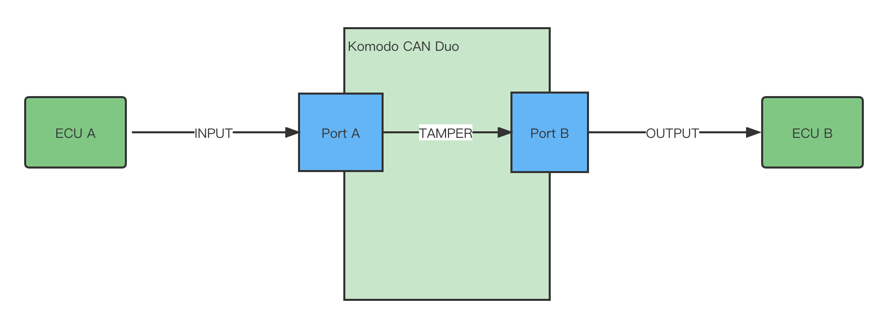

<!-- ABOUT THE PROJECT -->
## About The Project
This project is a komodo duo can device script that is used to does the MITM attack of CAN bus.

<!-- GETTING STARTED -->
## Getting Started

Get the komodo duo can device script from the website: https://www.totalphase.com/products/komodo-canduo/  

### Prerequisites

Download the komodo API library from the website and place it in your directory.
https://www.totalphase.com/products/komodo-software-api/


<!-- USAGE EXAMPLES -->
## Usage
Copy this scritp to the directory of the komodo API python library.

* python3
  ```python
  python3 can_mitm.py 0 0
  ```


